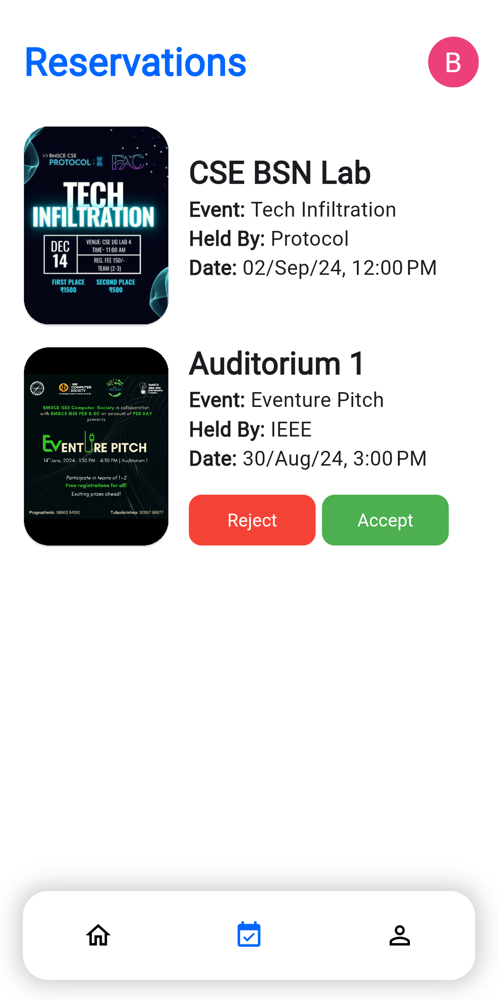

# CampusSpace

CampusSpace is a venue booking application developed to cater to the specific needs of B.M.S College of Engineering. The app streamlines the process of booking, checking availability, and managing reservations for various venues across the campus.

## Table of Contents

- [CampusSpace](#campusspace)
	- [Table of Contents](#table-of-contents)
	- [Introduction](#introduction)
	- [Features](#features)
	- [Screenshots](#screenshots)
	- [Acknowledgements](#acknowledgements)

## Introduction

CampusSpace aims to simplify the venue booking process, reducing administrative workload and saving time for all users. By automating various aspects of the booking process, CampusSpace enhances efficiency and reduces the potential for errors. With real-time availability and comprehensive reservation displays, CampusSpace promotes transparency in venue management.

## Features

- **User Registration and Authentication:** Secure login using college credentials.
- **Real-Time Availability Checking:** See available venues instantly to avoid double bookings.
- **Booking Management:** Book, view, and manage reservations easily.
- **Notification System:** Receive booking confirmations, reminders, and alerts.
- **Admin Controls:** Manage venues and booking approvals.

## Screenshots

Here are some screenshots of the CampusSpace app:

    
    
    
    
    
    

## Acknowledgements

Team Members contributing to this project:

- [Brijesh S G](https://github.com/brijesh-0)
- [Avyukth Inna](https://github.com/avyukthinna)
- [Ayman Khan](https://github.com/AymanKhan9)
- [Gurrala Naga Pragnathmik](https://github.com/starlord-9)

Logo Design by: [Aishwarya Kathasagaram](https://github.com/aish-kathasagaram)